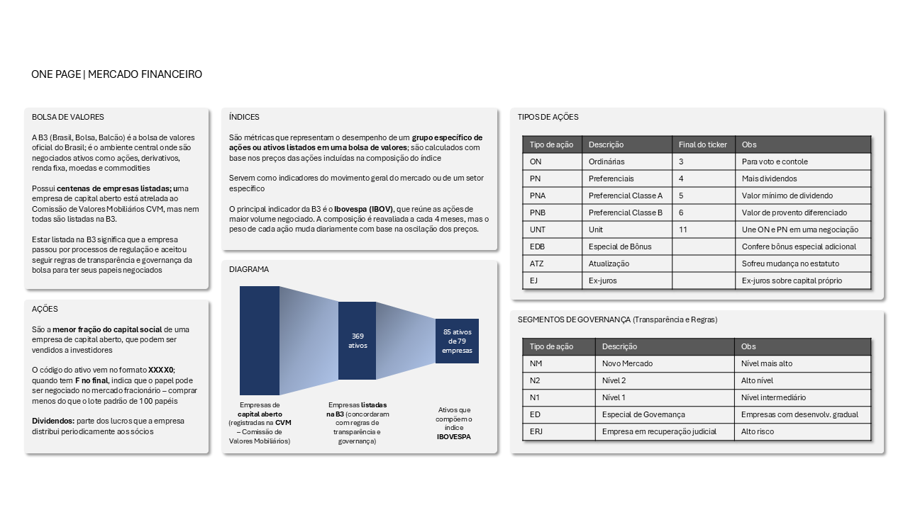

# Testes para o projeto do Tech Challenge Fase 2

A lista atualizada de ativos do Ibovespa (que no projeto foi acessada em 08/03/2026) está disponível [neste link](https://www.b3.com.br/pt_br/market-data-e-indices/indices/indices-amplos/indice-ibovespa-ibovespa-composicao-da-carteira.htm)

A lista de todas as empresas listadas na B3 com seus respectivos setores está disponível [neste link](https://www.b3.com.br/pt_br/produtos-e-servicos/negociacao/renda-variavel/empresas-listadas.htm), opção "Busca por Setor de Atuação"

As duas tabelas obtidas nos links acima são tratadas e relacionadas no notebook `tratar_lista_empresas.ipynb`

Segue um resumo dos principais conceitos relacionados à Bolsa de Valores, importantes para o entendimento de negócio do projeto antes de seguir com a infraestrutura:

